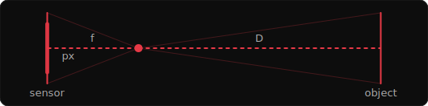
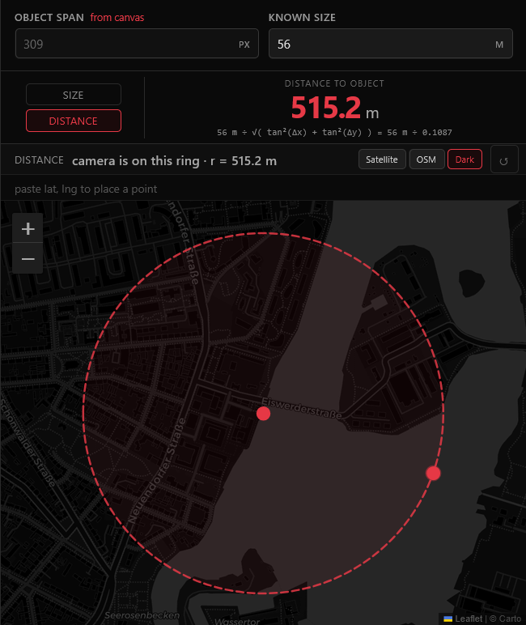

<h1> SiliconAperture</h1>

**Measure the real-world size of an object from a single photograph.**

`SiliconAperture` applies the pinhole camera model to a photograph: mark two points on an object, provide the distance to it and your camera's sensor dimensions, and the tool returns the object's physical size. No uploads. No server. Everything runs locally in your browser.

**[Try it live → kluter.github.io/SiliconAperture](https://kluter.github.io/SiliconAperture/)**


---

## Background

In 2012, on drone campaigns with fixed-wing platforms and a DSLR on a timer, images had to be calibrated the hard way: **Inner orientation** (focal length, principal point, distortion) and **outer orientation** (position and attitude in space). Before you could project any pixel back onto the ground and recover real-world distances. Ground control points laid out by hand, old-school remote sensing.

`SiliconAperture` distills that same principle down to its simplest useful form: one photo, one known distance, one measurement.

---

## How it works

The pinhole camera model relates image pixels to real-world distances through similar triangles:

<table>
<tr>
<td colspan="2">

<p align="center"><code>size = √( (D · tan(Δx / W · sw / f))² + (D · tan(Δy / H · sh / f))² )</code></p>

</td>
</tr>
<tr>
<td valign="middle">

| Symbol | Meaning |
|--------|---------|
| `D` | distance from camera to object |
| `Δx, Δy` | pixel span of the object, per axis |
| `W, H` | image width / height in pixels |
| `sw, sh` | sensor width / height in mm |
| `f` | focal length in mm |

</td>
<td valign="middle">



</td>
</tr>
</table>

Each axis is solved independently using its matching sensor dimension, then the two real-world components are combined with Pythagoras. This means the line you draw on the photo can be at any angle (horizontal, vertical, or diagonal), and the result is always the true Euclidean length, not its projection onto one axis.

Accurate results require the object to be **perpendicular to the camera axis**. If the surface is angled toward or away from the lens, the apparent extent seen by the sensor no longer maps linearly to the true physical size, and the measurement will be off.

---

## Solve for distance

<table>
<tr>
<td valign="top">

The same model runs in reverse. 

Toggle **Solve for → Distance**, enter an object's *known* real-world size, and SiliconAperture returns how far the camera was from it:

<p align="center"><code>D = size / √( tan(Δx / W · sw / f)² + tan(Δy / H · sh / f)² )</code></p>

Then click that object on the map to draw a **distance ring**. Every point that far away, i.e. the set of possible camera positions. Cross that ring with any other clue (a known bearing, a road, the skyline) and the camera's location narrows quickly.

</td>
<td valign="top">



</td>
</tr>
</table>

---

## Contributing

The camera database covers 960+ devices across 34 brands. Each entry carries a confidence marker:

| Marker | Dropdown label | Meaning |
|--------|---------------|---------|
| `[✓]` | **confirmed** | Verified from a GSMarena spec page (sensor format + focal length equivalent). `[✓] focal_eq ~` means the sensor was confirmed but the focal equivalent is approximate. |
| `[~]` | **unconfirmed** | Sensor family or optical format is known but not directly verified against a spec page. |
| `[?]` | **missing data** | No source data; values are estimates. |

**How a sensor size is found:** a `[✓]` value is *calculated* from hard data, using either pixel math (`width = pixels across × pixel pitch`) or EXIF (`width = 36 × focal ÷ 35mm-equivalent focal`). A `[?]` value is *estimated* from the marketing format alone (e.g. "1/2.55-inch"), which isn't a true measurement, so it's only a ballpark.

Some entries carry no marker: interchangeable-lens bodies (`focal_length: null`) and high-end fixed-lens cameras and drones (DJI, Sony RX, GoPro…), whose specs are published by the manufacturer.

> If you shoot with a device in the list and can verify or correct its sensor dimensions or focal length against real EXIF data, a PR or issue is very welcome. Same if your camera is missing entirely.

---

## How to use

1. **Drop a photo** onto the left panel (or click to browse).
2. **Select your camera** from the dropdown. If the image has EXIF metadata, the camera model, sensor dimensions, and focal length are filled in automatically. Otherwise pick from the list or enter sensor dimensions and focal length manually.
3. **Mark the object's extent** by clicking two points on the photo. The pixel span is calculated automatically. The line can be at any angle.
4. **Enter the distance** to the object in metres, or click two points on the satellite map to measure it.

The result appears as soon as all four inputs are valid.

### Keyboard shortcuts

| Key | Action |
|-----|--------|
| `R` | Reset marks |
| `N` | New image |
| `Esc` | Close help |

---

## Accuracy

The formula assumes a standard pinhole camera. Real lenses introduce distortion, but for moderate focal lengths (above ~24 mm equivalent) on well-corrected optics the error is small. The larger practical sources of error are:

- **Object not perpendicular to the camera axis.** A surface angled toward or away from the lens has its apparent extent foreshortened or expanded. The tool cannot detect or correct for this.
- **Sensor dimensions.** The database draws from manufacturer specs, DXOMark, and imaging-resource.com. Values marked approximate may differ from the production unit. For precision work, verify against the camera's service documentation.
- **EXIF focal length.** This is the physical focal length at the time of capture. Zoom lenses report their actual position. Cropped or binned images may carry the full-sensor focal length against a resized pixel grid. Verify the image dimensions match the sensor's native resolution.
- **Distance uncertainty.** The result scales linearly with `D`. A 5% distance error produces a 5% size error.

---

## Run it locally

A static site with no build step. Serve the folder with anything:

```bash
npx serve .
# or
python3 -m http.server
```

---

## Security & Privacy

Your photo never leaves your browser. It is drawn into a canvas and its EXIF is read in memory: no upload, no server. All EXIF text is written via `textContent`, so a file with crafted metadata cannot inject anything into the page.

The only outbound requests are map tiles from public tile servers (Esri, OpenStreetMap, Carto) and two libraries loaded from CDN.

```javascript
// Every network request SiliconAperture makes:
// GET unpkg.com/leaflet@1.9.4/...         (map library, once)
// GET cdn.jsdelivr.net/npm/exifr/...      (EXIF parser, once)
// GET .../tile/{z}/{x}/{y}                (map tiles)
// No image data, no coordinates, nothing else.
```

**Note on map tiles:** tile requests encode the area you are viewing. A tile server can infer what location you are measuring. Use a VPN if that matters.

### Dependencies

| Library | Purpose | Loaded from |
|---------|---------|-------------|
| [Leaflet](https://leafletjs.com/) | Map rendering | CDN (unpkg) |
| [exifr](https://github.com/MikeKovarik/exifr) | EXIF metadata parsing | CDN (jsDelivr) |

To run fully offline, download both libraries locally and replace the CDN links in `index.html`.

This tool was built with AI assistance. The code is plain, unminified JavaScript - read it directly in `js/script.js`.

---

## Related

 **[TracePoint](https://github.com/kluter/TracePoint)** - Geolocate a photo by intersecting lines of sight.

 **[ShadowFinder Web](https://github.com/kluter/ShadowFinder-Web)** - Geolocate a photo by the length of a shadow.
